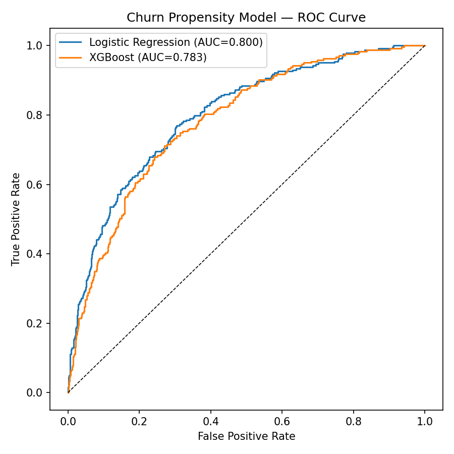

# Customer Churn / Propensity Model — Azure-Ready Deployment

A binary classification model predicting customer churn probability, trained,
compared, and packaged for deployment as an Azure ML endpoint or Azure
Function.

## Problem

Predict which customers are likely to churn so retention teams can prioritize
outreach — a classic propensity-modeling problem in banking/telecom analytics.

## Approach

1. **Data** (`src/generate_data.py`): 5,000 synthetic customer records
   (tenure, contract type, support calls, autopay, product count, satisfaction
   score) with a churn label generated from a realistic logistic relationship
   between those features. *(Synthetic — built to mirror the structure and
   ~25% churn rate of the classic Telco Customer Churn dataset, since live
   internet access to Kaggle wasn't available in this environment.)*
2. **Modeling** (`src/train.py`): trains and compares
   - **Logistic Regression** (interpretable baseline)
   - **XGBoost** (higher-capacity gradient boosting)

   on an 80/20 stratified split, scored by ROC-AUC.
3. **Deployment** (`azure_deploy/`): the winning model is packaged with an
   Azure ML-standard `init()`/`run()` scoring script, and an HTTP-triggered
   Azure Function wrapper for a lightweight serverless alternative. See
   `azure_deploy/DEPLOY.md` for exact deploy commands.

## Results

| Model | ROC-AUC |
|---|---|
| **Logistic Regression** | **0.800** |
| XGBoost | 0.783 |

Logistic regression won on this dataset — a reminder that a simpler,
interpretable model can outperform a more complex one, especially when the
underlying relationship (contract type, tenure, satisfaction) is close to
linear in log-odds, which is exactly how this data was generated.

**Top churn drivers** (XGBoost feature importance): contract type
(two-year/one-year vs. month-to-month), satisfaction score, autopay
enrollment, and tenure.



## Tech Stack

Python · scikit-learn · XGBoost · pandas · Azure ML scoring contract · Azure Functions

## Run it

```bash
pip install -r requirements.txt
python src/generate_data.py
python src/train.py
```

Then see `azure_deploy/DEPLOY.md` to deploy the trained model.

## What I'd extend next

- Swap in a real customer dataset once available
- Add SHAP values for per-customer explainability (useful for retention agents)
- Add a monitoring/drift-check step for the deployed endpoint
